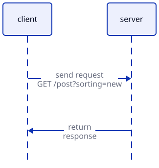

# REST API with FastAPI <!-- omit in toc -->

This repo contains notes and projects of the course [Mastering REST APIs with FastAPI](https://www.coursera.org/learn/packt-mastering-rest-apis-with-fastapi-1xeea/home) on [Coursera](https://www.coursera.org).

- [Module 1: Introduction](#module-1-introduction)
  - [What is an API?](#what-is-an-api)
  - [What is a web API?](#what-is-a-web-api)
  - [What is in a request?](#what-is-in-a-request)
  - [What is REST?](#what-is-rest)
  - [What is a resource?](#what-is-a-resource)
  - [What does stateless mean?](#what-does-stateless-mean)
  - [What does cacheable mean?](#what-does-cacheable-mean)
  - [What does hypermedia-driven mean?](#what-does-hypermedia-driven-mean)
  - [What does multiple servers mean?](#what-does-multiple-servers-mean)
  - [Conclusion](#conclusion)
- [Module 2: Working with FastAPI](#module-2-working-with-fastapi)
  - [What is FastAPI?](#what-is-fastapi)
  - [Aysnc functions](#aysnc-functions)
  - [WSGI vs. ASGI](#wsgi-vs-asgi)
  - [Thread vs. Coroutine](#thread-vs-coroutine)
  - [Deadlock](#deadlock)
  - [Race condition](#race-condition)
  - [Formatter](#formatter)
  - [Linter](#linter)
  - [Ruff](#ruff)
  - [Pydantic](#pydantic)
  - [Request Model](#request-model)
  - [Response Model](#response-model)
  - [API Routers](#api-routers)
  - [Project structure](#project-structure)
  - [Pyproject file](#pyproject-file)
- [Module 3: Introduction to pytest](#module-3-introduction-to-pytest)
  - [Basic of pytest](#basic-of-pytest)
  - [Assertions](#assertions)
  - [Testing exceptions](#testing-exceptions)
  - [Fixtures](#fixtures)
  - [Parametrized tests](#parametrized-tests)
  - [Mocking](#mocking)
  - [Measuring coverage](#measuring-coverage)
  - [Useful command-line options](#useful-command-line-options)
  - [Best practices](#best-practices)
- [Reference](#reference)


## Module 1: Introduction

### What is an API?
- An API is an **A**pplication **P**rogramming **I**nterface.
  - **Application:** is just code that runs and does somethings.
  - **Programming:** provides instructions to perform a task.
  - **Interface:** defines how things are allowed to interact with each other.
- So, *an API defines how two programes interact with each other.*
- *For example,* the database layer written in `db.py`, which contains functions and methods for database interaction, acts as an interface. The application, written in `app.py`, imports this module to communicate with the database.

### What is a web API?
- A web API defines *how two programes communicate by sending data over the Internet*.
- It's just like the code files but instead of one file asking another to do something, we've got one programe (*client*) asking another program (*server*) to do something. Instead of messages passing happening within a process between two Python files, we've got messages passing happening between two programes.
- Two programes communicate by sending requests.



### What is in a request?
There're 4 pieces of data in a request:
- **Method**: can be one of many different values like `GET`, `POST`, `PUT`, etc.
  - These values are essentially preset. These methods have meaning to most servers and clients.
  - So, usually servers will repond in a predictable way to each method.
  - *For example*,
    - `GET` method tends to be used to retrieve information.
    - `POST` method tends to be used to create information.
    - `PATCH` method tends to be used to modify an existing bit of information.
  - Some methods have certain restrictions.
  - *For example*, most requests can have a body, some data included in the request, but some methods don't support a body being sent. For instance, we couldn't use the `GET` method to send information to the server because it can't have a body in most cases.
- **Endpoint:** is where the request is sent.
  - *For example*, given an API url `api.com/post?sorting=new`.
    - `api.com`: is a host.
    - `/post`: is an endpoint.
    - `?sorting=new`: `sorting=new` is the `sorting` query string argument with a value of `new`.
      - It's a way to send extra data to the server.
- **Body:** usually is JSON data, used to when the client wants to send an extra information to the server.
- **Header:** is also information in key-value pairs, but the keys tend to have specific meaning.
  - *For example*, `Content-Type`, `Content-Length`, `Date`, etc.
  - Headers are specific key value pairs that mean something.

### What is REST?
REST is a set of architectural constraints.
- Use the concept of **client** and **server**.
- Use the concept of **resource**.
- Be **stateless**.
- Be **cacheable**.
- Have a uniform, hypermedia-driven interface.
- If backend use **multiple servers**, they're invisible to the client.

### What is a resource?
- Resources are *things* that the API deals in, such as: posts, comments, likes, users, etc.
- When the client makes a request, it's a request about a particular resource.
- When the server responds to a request, it does so with a resource representation.

### What does stateless mean?
- The server doesn't keep any information about the clients.
- In every request, the client has to send all the relevant information for the server to understand what's going on.
- The server doesn't remember anything about the client.
- Being stateless makes the server much simpler, much more straightforward to code, and also perform much faster.

### What does cacheable mean?
- If one client makes a request for information, it should be possible for the backend to save that response.
- So, if another client makes a request for the same information, it doesn't have to be recalculated.
- A cache is normally another layer in front of the API that remembers requests and the response that was sent back to that request.

### What does hypermedia-driven mean?
- If a resource is related to another resource, there should be an actual link in the response which allows the client to find the related resources.
- Most APIs don't implement it. It's an optional.

### What does multiple servers mean?
- Sometimes, backends are made up of multiple servers, *for example,* one for retrieving information, another for user authentication and registration.
- The client shouldn't care about how the backend is organized.

### Conclusion
- The API is the interface between the client and server. It isn't the actual processing and the work that goes in behind the scenes.
- The API is just the request, the responses, and the way the information is passed from one place to another.
- REST API defines how the interface should behave, not how the implementation or the architecture of the backend system.

## Module 2: Working with FastAPI

### What is FastAPI?
- FastAPI is a library that simplifies making APIs.
- FastAPI is a modern and async first library, which means that especially for web application development and APIs.
- It's very covinient and very fast performing option.

### Aysnc functions
- An `async` function means that the function can run more or less at the same time as other function.
- If **functions** that we're trying to run at the same time, **do heavy computation,** then they **can't run** at the same time.
- But, if **functions are just waiting** for the client to send some data or they're waiting for the database to respond to requests, or things like that, those functions **can run in parallel** more or less. That is where we get a speed benifit when we're using FastAPI and `async` functions.
- `async def` allows FastAPI to perform non-blocking I/O. When an endpoint `await`s **an asynchronous operation,** such as a database query or an external API call, the event loop **can suspend** that coroutine and **process other** incoming requests. *For example:*

  ```python
  from fastapi import FastAPI

  app = FastAPI()


  @app.get("/posts")
  async def get_posts():
      """
      Returns a list of posts
      """
      posts = await db.fetch_all(...)
      return posts
  ```

### WSGI vs. ASGI
- The main difference between WSGI (**W**eb **S**erver **G**ateway **I**nterface) and ASGI (**A**synchronous **S**erver **G**ateway **I**nterface) lies in their support for asynchronous code and modern comunication protocols.
- **WSGI** (**W**eb **S**erver **G**ateway **I**nterface):
  - Designed for **synchronous** Python application.
  - Each request is handled in a separate thread or process.
  - Blocks while handling I/O (e.g, reading from a DB or file).
- **ASGI** (**A**synchronous **S**erver **G**ateway **I**nterface):
  - Designed for **asynchronous** Python application.
  - Uses `asyncio` coroutines, allowing non-blocking I/O.
  - Can handle many more concurent requests efficiently.

| Features               | WSGI                             | ASGI                               |
|------------------------|----------------------------------|------------------------------------|
| **Sync / Async**       | Synchronous only                 | Asynchronous + Synchronous         |
| **Background task**    | Complex / Limited                | Simple & built-in                  |
| **Concurrency model**  | Thread-based                     | Coroutine-based (`asyncio`)        |
| **Protocol support**   | HTTP 1.1 only                    | HTTP 1.1, HTTP/2, WebSockets       |
| **Use cases**          | Classic web apps (Flask, Django) | Real-time app (FastAPI, Starlette) |
| **WebSockets support** | Not supported                    | Supported                          |

### Thread vs. Coroutine
- A **thread** is a real OS-level construct. Python uses threads via the `threading` module.
- Concurrency via threads is **preemptive**: the OS switches between threads as it sees fit.
- A **couroutine** is Python language feature for writing asynchronous code.
- We define one using `async def` and run it using `await`.
- Concurrency (using couritine) is **cooperative**: the coroutine yields control explicitly via `await`.

| Features              | Thread                       | Coroutine                                   |
|-----------------------|------------------------------|---------------------------------------------|
| **Definition**        | OS-managed unit of execution | Python-managed lightweight `async` function |
| **Managed by**        | Operating System             | Python runtime (`asyncio`)                  |
| **Context switching** | Done by OS (heavy)           | Done by Python (lightweight)                |
| **Overhead**          | High (memory and CPU)        | Low                                         |
| **Blocking behavior** | Can block entire thread      | Non-blocking with `await`                   |
| **Use case**          | Legacy I/O apps              | High I/O concurrency (web apps, scrapping)  |
| **Drawbacks**         | GIL, context switch cost     | Must avoid blocking code (`time.sleep`)     |
| **Complexity**        | Deadlocks, race conditions   | Harder debugging, async-first mindset       |

### Deadlock
- A deadlock happens when two (or more) tasks are waiting for each other forever.
- *For example*, task 1 has `lock_a`, but waits for `lock_b`, task 2 has `lock_b`, but waits for `lock_a`.
- When deadlock happens, **nobody can move**.

### Race condition
- A race condition happens when two tasks access and modify shared data at the same time, and the result depends on the timing of their execution.
- *For example*, two threads read a global variable before writing back. It leads to the updates overlap and overwrite each other.
- When a race condition happens, the result is wrong or unstable.

| Features         | Deadlock                           | Race condition                     |
|------------------|------------------------------------|------------------------------------|
| **What happens** | Everything stops                   | Things run, but produce wrong data |
| **Cause**        | Circular wait for resources        | Concurrent access to shared data   |
| **Symptom**      | Program hangs                      | Wrong / Unstable output            |
| **Fix**          | Avoid circular locks, use timeouts | Use locks or atomic operations     |

### Formatter
- A formatter is a **code beautifier**.
- **Formatter** automatically **rewrites** the code so it follows a consistent style, without changing its behavior.
- Formatter focuses on whitespace, indentation, line breaks.
- Popular tool: [black](https://pypi.org/project/black/), [yapf](https://pypi.org/project/yapf/), [ruff](https://pypi.org/project/ruff/).


### Linter
- A linter is a **code quality checker**.
- **Linter** analyzes the code to detect issues and bad practices such as:
  - style violations (PEP8 rules, naming conventions, unused imports).
  - possible bugs (undefined variables, unreachable code).
  - best practices warnings (bad complexity, security concerns)
- Linter **doesn't change** code, only reports issues.
- Popular tools: [flake8](https://flake8.pycqa.org/en/latest/), [pylint](https://pypi.org/project/pylint/), [ruff](https://pypi.org/project/ruff/) (fast, Rust-based).

### Ruff
- Ruff is a modern Python tool that **can replace** several tools such as `black`, `isort`, and part of Flake8 workflows. It is **extremely fast** and **provides both** code formatting and linting capabilities.
- `ruff format` is used **to format** Python files. It works as a formatter.

  ```bash
  # find and format all Python files in the project
  ruff format .

  # format a single Python file
  ruff format social_media_api/routers/posts.py
  ```
- If we want to **only check** whether the code is correctly formatted, we use the option `--check`.

  ```bash
  ruff format --check .
  ruff format --check social_media_api/routers/posts.py
  ```
- `ruff check` is used to **analyze** code **and detect** potential problems. It works as a linter.

  ```bash
  # find and check all Python files in the project
  ruff check .

  # check a single Python file
  ruff check social_media_api/routers/posts.py
  ```
- If we want to **fix** issues **when possible,** we can use the option `--fix`.

  ```bash
  ruff check --fix .
  ruff check --fix social_media_api/routers/posts.py
  ```
- In a real Python project, a **common workflow** is:

  ```bash
  # format code
  ruff format .

  # run lint checks and fix issues when possible
  ruff check --fix .
  ```
- Configure `ruff` in `pyproject.toml`

  ```toml
  [tool.ruff]
  line-length = 100

  [tool.ruff.format]
  quote-style = "double"

  [tool.ruff.lint]
  select = ["E", "F", "I"]
  ```

  Explaination:
  - `line-length = 100`: maximum line length.
  - `quote-style = "double"`: use double quote.
  - `select = ["E", "F", "I"]`: check rules start with `E` (*style / coding convention*), `F` (*simple code logic like unused imports, variables, undefined variables, etc.*), and `I` (*imports organizing*)

### Pydantic
- [Pydantic](https://docs.pydantic.dev/latest/) is a Python library for **data validation** and **settings management** using Python type hints.
- It ensures that _"data looks exactly how we expected it to"_ without writting manual checks.
- What Pydantic does:
  - **Validate data**: Make sure values are of the right type.
  - **Parse data**: Convert compatible inputs automatically (e.g, `"123"` -> `123`).
  - **Serialize data**: Output data as clean Python dicts or JSON.
  - **Settings management**: Load configuration from environment variables or files.
- Key features:
  - **Type safety**: Uses Python type hints for validation.
  - **Automatic parsing**: Strings, lists, and other formats get converted when possible.
  - **Clear error messages**: If data is invalid, it raises a detailed `ValidationError`.
  - **Optional default**: Use default values for missing data.
  - **Setting models**: Easily load config from `.env` or OS environment variables.

### Request Model
- A **request model** in FastAPI is just a **Pydantic model** that is used to describe and validate the shape of incoming data (usually JSON in the request body). *For example:*

  ```python
  from pydantic import BaseModel


  class PostIn(BaseModel):
    """
    Represents the incoming post data sent to the API.
    Used for validating and storing fields provided by the client.
    """

    body: str
  ```
- **How to use it?** Defining a Pydantic model and **use** it as **type hint** of a function parameter in a FastAPI route.

  ```python
  from fastapi import APIRouter

  from social_media_api.models.post import Post, PostIn

  router = APIRouter(prefix="/posts", tags=["Posts"])


  @router.post("", response_model=Post, status_code=201)
  async def create_post(post: PostIn):
      """
      TODO: Creates a post
      """
  ```
- **What it does?** When a defined Pydantic model is used as type hint of a function parameter in a FastAPI route, it:
  - **parses** the incoming request body into that model.
  - **validates** types and required fields.
    - If the data is **invalid,** FastAPI returns a `422 Unprocessable Entity` with a detailed error message.
    - **If valid,** a fully typed Python object is available to work inside the function.
  - If an **extra field** is included incoming data, it can be ignored or raise an error depending on Pydantic version and model configuration.
    - Pydantic v1 will raise a validation error.
    - Pydantic v2.11 will silently drop extra fields.
    - The behavior can be changed via model configuration.
- **Why use request models?**
  - Automatic **type conversion**: strings to ints, dates, etc.
  - Automatic **error handling**.
  - Built-in **API docs** with request schema in `/docs`.
  - **Security**: ensures clients can't send unexpected or malicious fields.

### Response Model
- The `respone_model` parameter in FastAPI's route decorators (`@app.get`, `@app.post`, etc.) tells FastAPI **take whatever I return** from this function, **validate** and **filter** it through this Pydantic model, and **use** that as the **response schema** in the API docs. *For example:*

  ```python
  # models/post.py
  class Post(PostIn):
    """
    Represents the post data returned to the client.
    Used for formating and sending post information in API responses.
    """

    id: int


  # routers/posts.py
  @router.post("", response_model=Post, status_code=201)
  async def create_post(post: PostIn):
      """
      TODO: Creates a post
      """
  ```
- **What it does?**
  - **Validation**: Ensures that the endpoint returns data matching the model. If the return data is missing fields, has wrong types, or has extra fields, FastAPI will handle it (filter or error depending on config).
  - **Serialization**: Converts Pydantic models, datetimes, enums, etc. into JSON-friendly types.
  - **Documentation**: The OpenAPI schema (Swagger UI at `/docs`) will automatically show the model as the shape of the response.
- **Why it's important?**
  - Keeps API **responses consistent.**
  - **Prevents leaking** sensitive fields from the database.
  - **Generates accurate API docs** without extra work.
  - **Validates outgoing data,** just like request models validate **incoming** data.

### API Routers
- `APIRouter` in FastAPI is a way to organize routes into separate, reusable groups instead of putting everything directly in an application instance.
- ​An `APIrouter` is basically a FastAPI app, but **instead** of running on its own, ​it **can be included** into an existing app.
- Why use `APIRouter`?
  - **Modular organization**: Keep related endpoints together (e.g, `posts.py`, `comments.py`).
  - **Reusable**: Routers can be imported and included in multiple apps or microservices.
  - **Versioning** & **prefixes**: Easily group endpoints under `/api/v1`, `/auth`, etc.
  - **Shared settings**: Apply tags, dependencies, or responses to a whole group.

- *For example:*
  - `routers/posts.py`

    ```python
    from fastapi import APIRouter

    from social_media_api.models.post import Post, PostIn

    router = APIRouter(prefix="/posts", tags=["Posts"])


    @router.post("", response_model=Post, status_code=201)
    async def create_post(post: PostIn):
        """
        TODO: Creates a post
        """


    @router.get("", response_model=list[Post])
    async def get_all_posts():
        """
        TODO: Returns a list of posts
        """
    ```
  - `main.py`
    ```python
    from fastapi import FastAPI

    from social_media_api.routers.posts import router as post_router

    app = FastAPI()
    app.include_router(post_router)

    ```

### Project structure
- For small to medium-sized FastAPI projects, this is a recommended structure:
  - `routers`: **handle** HTTP requests and responses.
  - `models`: define the **database schema** using SQLAlchemy ORM models.
  - `schemas`: define **Pydantic models** for request and response validation.

  *For example:*

  ```text
  project/
  │
  ├── social_media_api/
  │   ├── __init__.py
  │   ├── main.py
  │   │
  │   ├── routers/   # HTTP layer
  │   │   ├── __init__.py
  │   │   └── comments.py
  │   │   └── posts.py
  │   │
  │   ├── models/   # ORM models (database schema)
  │   │   ├── __init__.py
  │   │   └── comment.py
  │   │   └── post.py
  │   │
  │   ├── schemas/   # Pydantic models (data schema)
  │   │   ├── __init__.py
  │   │   └── comment.py
  │   │   └── post.py
  │   │
  │   ├── database.py
  │   └── config.py
  │
  ├── tests/
  ├── Dockerfile
  ├── requirements.txt
  └── pyproject.toml   # optional but recommended
  ```
- As the project grows, we can introduce additional layers:
  - `services`: implement the **business logic** (*permissions, validation beyond schema checks, workflows, notifications, rate limits, etc.*) and coordinate application workflows.
  - `repositories` (*optional*): encapsulate **database access** and data persistence logic.
- **Convention:**
  - Use **plural names** for `routers` because each router manages a collection of resources.
  - Use **singular names** for `models`, `schemas` because the filename represents one model class.

### Pyproject file
- `pyproject.toml` is one of the most important files in a modern Python project. It serves as a **central configuration file** for the project.
- It stores the **project metadata.**

  ```toml
  [project]
  name = "social-media-api"
  version = "1.0.0"
  requires-python = ">=3.11"
  ```
- It stores the **configuration of tools** like `ruff`, `pytest`, etc.
  ```toml
  [tool.ruff]
  line-length = 100

  [tool.ruff.format]
  quote-style = "double"

  [tool.ruff.lint]
  select = ["E", "F", "I"]


  [tool.pytest.ini_options]
  testpaths = ["tests"]
  ```
- It **makes** development and CI/CD configuration **consistent.** Instead of specifying options in command-lines, the tools automatically read their configuration from `pyproject.toml` .

## Module 3: Introduction to pytest

### Basic of pytest
- `pytest` is a testing framework that helps:
  - write automated tests.
  - verify code behaves correctly.
  - detect regressions when we change code.
  - integrate with CI/CD pipelines.
- `pytest` automatically discovers files named: `test_*.py`, `*_test.py`.
- The `tests` directory is **commonly located** at the project root, **outside** the application packages. *For example:*

  ```text
  project/
  │
  ├── social_media_api/
  │   ├── main.py
  │   ├── routers/
  │   └── schemas/
  │
  ├── tests/
  │   ├── test_posts.py
  │   └── test_comments.py
  │
  └── pyproject.toml
  ```

### Assertions
- `pytest` uses normal Python `assert`, no need methods like `self.assertEqual` in `unittest`. *For example:*

  ```python
  def test_add_two():
      """
      Performs a basic test case
      """
      x = 1
      y = 2
      assert x + y == 3
  ```
- uses the `<=` operator to check whether an dictionary is a subset of another. *For example:*

  ```python
  def test_dict_contains():
      """
      Check whether one dictionary is a subset of another.
      """
      expected = {"name": "Alice"}
      actual = {"name": "Alice", "age": 23}
      assert expected.items() <= actual.items()
  ```

### Testing exceptions
`pytest.raises` is used to **verify** the **expected error** is raised. *For example:*

```python
def test_divide_by_zero():
    """
    Verifies that the expected error is raised.
    """
    # verify the error type
    with pytest.raises(ZeroDivisionError) as exc_info:
        assert 10 / 0

    # verify the error message
    assert str(exc_info.value) == "division by zero"
```

### Fixtures
- Fixtures are one of the most powerful features of `pytest`. They are used to **provide reusable setup and teardown logic** for tests. *For example:*

  ```python
  @pytest.fixture
  def user():
      return {
          "id": 1,
          "name": "Alice"
      }


  def test_user_name(user):
      """
      Verifies user's name
      """
      assert user["name"] == "Alice"
  ```
- A **fixture can** create objects, open database connections, prepare test data, start services, configure clients, etc.
- The fixture scope **controls how often** a fixture **is created** and **destroyed.** Pytest has 5 built-in scopes:

  | Scope                   | Created                       | Destroyed                 |
  |-------------------------|-------------------------------|---------------------------|
  | `function` (*default*)  | once per test **function**    | after each test           |
  | `class`                 | once per test **class**       | after class finishes      |
  | `module`                | once per Python **file**      | after module finishes     |
  | `package`               | once per **package**          | after package finishes    |
  | `session`               | once per **entire** test run  | after all tests finishes  |

  *For example:*

  ```python
  @pytest.fixture
  def user():
      """
      Fake user
      """
      print("\nfake user")
      return {"id": 1, "name": "Alice"}


  def test_first_use_user_fixture(user):
      """
      First use the user fixture
      """


  def test_second_use_user_fixture(user):
      """
      Second use the user fixture
      """


  @pytest.fixture(scope="module")
  def fixture_db():
      """
      Fake database connection
      """
      print("\nfake database connection")


  def test_first_use_db_fixture(db):
      """
      First use the db fixture
      """


  def test_second_use_db_fixture(db):
      """
      Second use the db fixture
      """
  ```

  In the example above,
  - The fixture `user` defaults to `function` scope, causing `fake user` to **print twice.**
  - The `db` fixture uses `module` scope, so `fake database connection` prints **only once despite** being referenced in two tests.
- Fixtures often require cleanup, such as closing database connection or files. **Place** any **teardown code after** the `yield`, it **will run once** the test completes. *For example:*

  ```python
  @pytest.fixture(scope="module", name="db")
  def fixture_db():
      """
      Fake database connection
      """
      print("\nfake open database connection")
      yield
      print("\nfake close database connection")
  ```
- By default, `pytest` **provides fixtures only** when requested. Setting `autouse=True` **makes** the fixture **run automatically.** *For example:*

  ```python
  @pytest.fixture(autouse=True)
  def setup_env():
      """
      Fake setup environment
      """
      print("\nfake setup environment")
  ```
- **Be careful** with `autouse` fixtures since they **run for every test within their scope,** which may be unnecessary.
  - **Autouse** fixtures are **suitable for global** setup or teardown tasks.
  - It **should not be used for** database fixtures, as many tests do not need database setup.
- **Apply** the `@pytest.mark.usefixtures` decorator allows **to specify fixtures for a test without referencing them** in the function signature. *For example:*

  ```python
  @pytest.mark.usefixtures("db")
  async def test_create_post_success(async_client: AsyncClient):
      """
      Ensures the create-post endpoint produces a new post successfully
      """
  ```
  `@pytest.mark.usefixtures` accepts **multiple fixture names.** *For example,* `@pytest.mark.usefixtures("db", "other fixture")`.
- `conftest.py` is a **special** `pytest` **configuration file** whose **fixtures are shared** across all tests in the project. Pytest **searches fixtures** in this order:

  ```text
  test file
      |
      v
  same directory conftest.py
      |
      v
  parent directory conftest.py
      |
      v
  pytest plugins
  ```

  *For example:*

  ```text
  tests/
  │
  ├── conftest.py       # available everywhere
  │
  ├── routers/
  │   ├── conftest.py   # only routers tests
  │   └── test_posts.py
  │
  └── schemas/
      └── test_post.py
  ```

### Parametrized tests
- Parametrized tests allow to **run the same test logic** with **multiple sets of input data** without duplicating the test function. *For example:*

  ```python
  @pytest.mark.parametrize("number", [2, 4, 6])
  def test_is_even(number):
      """
      Checks whether number is even
      """
      assert number % 2 == 0
  ```
- The decorator `pytest.mark.parametrize` is used to **create** parameterized tests.
- We can **parameterize several arguments.** *For example:*

  ```python
  @pytest.mark.parametrize(
      "a, b, expected",
      [
          (1, 2, 3),
          (-5, -3, -8),
          (10, -20, -10),
      ],
  )
  def test_add(a, b, expected):
      """
      Performs addition tests
      """
      result = a + b
      assert result == expected
  ```
- We can **use** `ids` parameter to give test cases **meaningful names.** *For example:*

  ```python
  @pytest.mark.parametrize(
      "a, b, expected",
      [
          (1, 2, 3),
          (-5, -3, -8),
          (10, -20, -10),
      ],
      ids=["positive numbers", "negative numbers", "mix numbers"],
  )
  def test_add(a, b, expected):
      """
      Performs addition tests
      """
      result = a + b
      assert result == expected
  ```

### Mocking
- Mocking **replaces a real dependency** with a fake object so code can **be tested in isolation.** *For example,* instead of making real database access during a test, use a `Mock()` to make it faster, isolated, and reproducible.

  ```python
  # posts.py
  class PostService:  # pylint:disable=R0903
      """
      PostService class
      """

      def __init__(self, repository: dict[int, dict]) -> None:
          self.repository = repository

      def get_post_by_id(self, post_id: int) -> dict:
          """
          Retrieves post from database
          """
          return self.repository.get(post_id, {})


  # test_posts.py
  from unittest.mock import Mock

  from tests.basics.posts import PostService


  def test_get_post_from_database():
      """
      Checks that the database returns the expected post
      """
      repository = Mock()
      repository.get.return_value = {
          "userId": 1,
          "id": 1,
          "title": "fake title",
          "body": "fake body",
      }
      post_service = PostService(repository)
      result = post_service.get_post_by_id(1)
      expected = {"id": 1}
      assert expected.items() <= result.items()
  ```
- `return_value` **defines** exactly **what the mock should return** when called. *For example:*

  ```python
  repository = Mock()
  repository.get.return_value = {
      "userId": 1,
      "id": 1,
      "title": "fake title",
      "body": "fake body",
  }
  ```
- More commonly `patch()` is used to temporarily replace a real object. *For example:*

  ```python
  # posts.py
  import requests

  BASE_URL = "https://jsonplaceholder.typicode.com/posts"


  def get_post(post_id: int):
      """
      Retrieves a post from external API
      """
      url = f"{BASE_URL}/{post_id}"
      response = requests.get(url, timeout=5)
      return response.json()


  # test_posts.py
  from unittest.mock import patch

  from tests.basics.posts import get_post


  def test_get_post_from_api():
      """
      Checks that the API returns the expected post
      """
      with patch("tests.basics.posts.requests.get") as mock_get:
          mock_get.return_value.json.return_value = {
              "userId": 1,
              "id": 1,
              "title": "fake title",
              "body": "fake body",
          }
          result = get_post(1)
      expected = {"id": 1}
      assert expected.items() <= result.items()
  ```
  **Notes:**
  - The **dotted path** in `path()` tells `pytest` the function `requests.get` in `tests.basics.posts` is **temporarily replaced** by a mock **inside** the `with` block.
  - **Path** the name **where the code** under test **looks it up** (`tests.basics.posts.requests.get` *in the example*), **not** where the object was originally defined (`requests.get` *in the example*).
- `MagicMock` is essentially a **more powerful** `Mock` that **supports** Python's **magic methods,** such as `__len__`, `__iter__`, `__getitem__`, `__enter__`, `__exit__`, etc.
- `side_effect` **allows** the mock to **perform custom logic** such as *raise exception*, *return different values per call*, or *execute a callable* instead of returning a fixed value. *For example:*

  ```python
  def test_get_post_db_error():
      """
      Checks that the database triggers the expected exception
      """
      repository = Mock()
      repository.get.side_effect = ConnectionError("Database unavailable")
      post_service = PostService(repository)
      with pytest.raises(ConnectionError):
          post_service.get_post_by_id(1)
  ```
- The mocking approach for **async functions** mirrors that of the sync functions, **use** `AsyncMock` to **mock async dependencies.** *For example:*

  ```python
  # async_posts.py
  import asyncio

  from httpx import AsyncClient

  BASE_URL = "https://jsonplaceholder.typicode.com/posts"


  async def async_get_post(client: AsyncClient, post_id: int):
      """
      Retrieves a post from external API
      """
      url = f"{BASE_URL}/{post_id}"

      response = await client.get(url)
      response.raise_for_status()
      return response.json()


  # test_posts.py
  from unittest.mock import AsyncMock, Mock

  import pytest
  from httpx import HTTPStatusError

  from tests.basics.async_posts import async_get_post


  @pytest.mark.asyncio
  async def test_async_get_post():
      """
      Checks that the async function returns the expected post
      """
      response = Mock()
      response.json.return_value = {
          "userId": 1,
          "id": 1,
          "title": "fake title",
          "body": "fake body",
      }

      client = AsyncMock()
      client.get.return_value = response

      result = await async_get_post(client, 1)
      expected = {"id": 1}
      assert expected.items() <= result.items()


  @pytest.mark.asyncio
  async def test_async_get_post_http_error():
      """
      Checks that the async function triggers the expected exception
      """
      response = Mock()
      response.raise_for_status.side_effect = HTTPStatusError(
          "404 Not Found", request=Mock(), response=Mock()
      )

      client = AsyncMock()
      client.get.return_value = response

      with pytest.raises(HTTPStatusError):
          await async_get_post(client, 999)
  ```
  **Notes:**
  - `pytest` **does not natively support** `async def` tests. It **needs to install** a suitable plugin, such as `pytest-asyncio` to run `async def` tests.
  - `@pytest.mark.asyncio` **instructs** `pytest` to execute the test **using** an `asyncio` **event loop.** Alternatively, with **proper** `pyproject.toml` **configuration,** `pytest-asyncio` can **detect** `async def` tests **automatically.**

    ```toml
    [tool.pytest.ini_options]
    asyncio_mode = "auto"
    ```

### Measuring coverage
- Test coverage measures **how much of code is executed** while **tests are running.** *For example,* given the `get_post()` function and the `test_get_post()` test below:

  ```python
  # posts.py
  def get_post(post_id: int):
      if post_id <= 0:
          raise ValueError("Invalid ID")
      return repository.get(post_id)


  # test_post.py
  def test_get_post():
      post = get_post(1)
      assert post["id"] == 1
  ```
  When the test executes, only a part of the code is tested. Coverage identifies that.
  ```text
  def get_post()
      │
      ├── if post_id <= 0  ← executed
      │
      ├── raise ValueError ← NOT executed
      │
      └── repository.get() ← executed
  ```
- It **needs to install** `pytest-cov` **plugin** to test coverage.
  - Measure **all** project code.

    ```bash
    pytest --cov
    ```
  - Measure **only application** code.

    ```bash
    pytest --cov=social_media_api
    ```
  - Generate an **HTML report.** This visual report shows which lines were executed and which weren't.

    ```bash
    pytest --cov=social_media_api --cov-report=html
    ```
  - In the resultat, the **important columns** are:
    - `Stmts`: indicates the number of **executable statements.**
    - `Miss`: indicates the number of **statements not executed.**
    - `Cover`: indicates the **percentage executed.**

    *For example:*

    ```bash
    ------ coverage: platform win32, python 3.13.14-final-0 ------

    Name                                   Stmts   Miss  Cover
    ----------------------------------------------------------
    social_media_api\__init__.py               0      0   100%
    social_media_api\database.py               3      0   100%
    social_media_api\main.py                   6      0   100%
    social_media_api\routers\__init__.py       0      0   100%
    social_media_api\routers\comments.py      15      8    47%
    social_media_api\routers\posts.py         28     13    54%
    social_media_api\schemas\__init__.py       0      0   100%
    social_media_api\schemas\comment.py        6      0   100%
    social_media_api\schemas\post.py           9      0   100%
    ----------------------------------------------------------
    TOTAL                                     67     21    69%
    ```
- The following `pyproject.toml` configuration **restricts** coverage measurement **to application code** by default.

  ```toml
  [tool.coverage.run]
  source = ["social_media_api"]
  ```

### Useful command-line options
- Run all tests: `pytest`.
- Run only one file: `pytest tests/test_simple.py`.
- Run only one test function: `pytest tests/test_simple.py::test_add_two`.
- Verbose output: `pytest -v`.
- Show `print()` output: `pytest -s`.
- Stop after the first failure: `pytest -x`.
- Show all fixtures: `pytest --fixtures`.
- Show fixtures used for each test: `pytest --fixture-per-test`.

### Best practices
- Keep tests **independent:** one test should not rely on another.
- Follow the **Arrange-Act-Assert (AAA)** pattern:
  - **Arrange:** set up data.
  - **Act:** call the code under test.
  - **Assert:** verify the result.
- Use **fixtures for shared setup.**
- Mock **external dependencies** (HTTP services, email providers, etc.).
- Use **a separate test database** rather than a development or production datbase.
- Run tests **automatically** in CI/CD pipeline.

## Reference

1. [Mastering REST APIs with FastAPI](https://www.coursera.org/learn/packt-mastering-rest-apis-with-fastapi-1xeea/)
2. [Mastering REST APIs with FastAPI, by Packt Publishing](https://github.com/vuanhtuan1012/Mastering-REST-APIs-with-FastAPI)
3. ChatGPT
